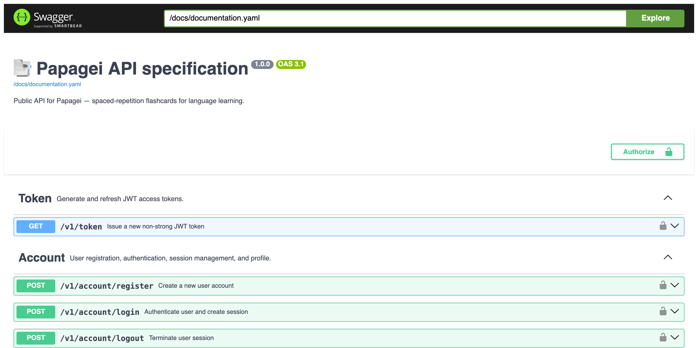

<h1 align="center" style="font-weight: bold;">Papagei Backend 🦜</h1>

<p align="center">
    <a href="https://github.com/JetBrains/kotlin">
        
    </a>
    <a href="https://github.com/ktorio/ktor">
        
    </a>
    
    <a href="https://github.com/papagei-service/backend/blob/main/LICENSE">
        
    </a>
</p>

A backend for [Papagei](https://github.com/papagei-service) — a spaced-repetition flashcard service for language learning.

The repository contains a Kotlin + Ktor HTTP API (with WebSocket support) backed by PostgreSQL and using Exposed as the database toolkit.

---

## 🚀 Project Overview

- **Language & framework:** Kotlin, Ktor
- **Design patterns:** Clean architecture, RESTful API
- **Storage:** PostgreSQL (incl. automatic. DB schema migrations)
- **Authentication**:
    - JWT-based API keys (strong & regular)
    - Session-based user authentication
- **CRUD operations** for collections, cards and examples
- **WebSocket API** for spaced-repetition card answering
- **API docs:** OpenAPI + Swagger UI available at `/docs`
- **Testing:** JUnit (coverage >85%)
- **Automation:**
    - Docker Compose config files for testing and deployment
    - GitHub Actions workflows for testing and version control

---

## ▶️ Running the Backend

### Option 1: Without using Docker Compose (better for development)

<details>
  <summary>Run the tests (Linux/MacOS)</summary>

1. Open the `env/test.env` file. Set the value of variable `DB_HOST` to `localhost`.

```text
DB_HOST=localhost
```

2. Start the PostgreSQL container via Docker with the `env/test.env` file.

```shell
docker run -d \
  --name papagei-test-db \
  -p 5432:5432 \
  --env-file ./env/test.env \
  postgres:18-alpine3.23
```

3. Run the application with the environment variables:

```shell
(set -a && source ./env/test.env && set +a && ./gradlew :test)
```

</details>

<details>
  <summary>Run the server (Linux/MacOS)</summary>

1. Navigate to the `env` directory and create a new file `prod.env`.

2. Copy all of the contents from the `prod.env.example` file and paste them into the `prod.env` file.

```text
JWT_SECRET=
PEPPER=
PORT=

DB_HOST=
DB_PORT=
DB_NAME=
DB_USER=
DB_PASSWORD=

POSTGRES_DB=
POSTGRES_USER=
POSTGRES_PASSWORD=
```

3. Assign values to variables by analogy with the `test.env` file. Set the value for the `DB_HOST` variable to `localhost` and `DB_PORT` to `5432`. Other values should be different and unique.


> [!WARNING]
> The values of the variables in this file must be kept strictly confidential. They must differ from the values of the variables in the `test.env` file and be difficult to guess.

4. Navigate back to the root of the project.

5. Start the PostgreSQL container via Docker with the `env/prod.env` file.

```shell
docker run -d \
  --restart always \
  --name papagei-prod-db \
  -p 5432:5432 \
  --env-file ./env/prod.env \
  -v papagei_prod_db:/var/lib/postgresql/data \
  postgres:18-alpine3.23
```

6. Run the application with the environment variables:

```shell
(set -a && source ./env/prod.env && set +a && ./gradlew :run)
```

7. Check if the server is working and accepting requests. Follow the link http://127.0.0.1:8080/docs. This should take you to a page with the API specification, which looks like this.



</details>

### Option 2: Using Docker Compose (better for deployment)

<details>
  <summary>Run the tests (Linux/MacOS)</summary>

1. Open the `env/test.env` file. Set the value of variable `DB_HOST` to `papagei-test-db`. 

```text
DB_HOST=papagei-test-db
```

2. Start the PostgreSQL and backend containers via Docker Compose.

```shell
docker compose -f ./compose/docker-compose.test.yaml up \
  --build \
  --abort-on-container-exit
```

</details>

<details>
  <summary>Run the server (Linux/MacOS)</summary>

1. Navigate to the `env` directory and create a new file `prod.env`.

2. Copy all of the contents from the `prod.env.example` file and paste them into the `prod.env` file.

```text
JWT_SECRET=
PEPPER=
PORT=

DB_HOST=
DB_PORT=
DB_NAME=
DB_USER=
DB_PASSWORD=

POSTGRES_DB=
POSTGRES_USER=
POSTGRES_PASSWORD=
```

3. Assign values to variables by analogy with the `test.env` file. Set the value for the `DB_HOST` variable to `localhost` and `DB_PORT` to `5432`. Other values should be different and unique.


> [!WARNING]
> The values of the variables in this file must be kept strictly confidential. They must differ from the values of the variables in the `test.env` file and be difficult to guess.

4. Navigate back to the root of the project.

5. Start the PostgreSQL and backend containers via Docker Compose.

```shell
docker compose -f ./compose/docker-compose.prod.yaml up --build
```

7. Check if the server is working and accepting requests. Follow the link http://127.0.0.1:8080/docs. This should take you to a page with the API specification, which looks like this.


</details>

---

## 🤝 Contributing

- Follow existing code patterns (Kotlin + Ktor idioms)
- Add SQL migration scripts to `migrations/` when DB schema changes; name them with a prefix like `V02__...sql`.
- Add tests for new features and test locally.
- Open PRs targeting `main` and ensure CI checks pass.

---

## 📄 License

This project is licensed under the **Apache 2.0** License — see the `LICENSE` file.
